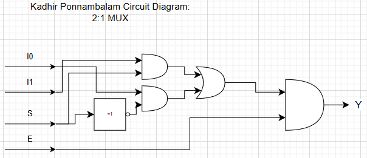
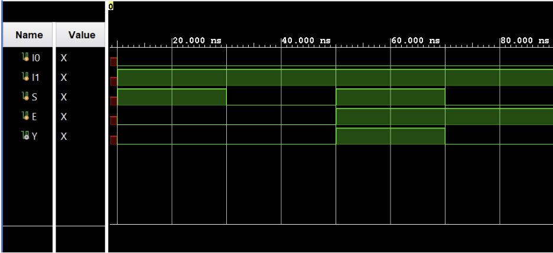

## 2:1 Multiplexer | Verilog

A Verilog implementation of a **2:1 multiplexer with enable**, developed and simulated in the Vivado IDE. This document explains what a multiplexer is, how a **2:1 MUX** behaves, derives the **Boolean equation**, summarizes the **circuit, waveform, and testbench results**, and provides steps to run the project in Vivado.

---

## Table of Contents

- [What Is a 2:1 Multiplexer?](#what-is-a-21-multiplexer)
- [2:1 MUX Truth Table and Behavior](#21-mux-truth-table-and-behavior)
- [Boolean Equation and Logic Simplification](#boolean-equation-and-logic-simplification)
- [2:1 Multiplexer Architecture](#21-multiplexer-architecture)
- [Learning Resources](#learning-resources)
- [Circuit Diagram](#circuit-diagram)
- [Waveform Diagram](#waveform-diagram)
- [Testbench Output](#testbench-output)
- [Running the Project in Vivado](#running-the-project-in-vivado)
- [Project Files](#project-files)

---

## What Is a 2:1 Multiplexer?

A **multiplexer (MUX)** is a combinational circuit that selects **one of several input signals** and forwards it to a **single output line**, based on the value of **selector inputs**.

In general:

- **n** = number of data inputs  
- **m** = number of select lines  
- They are related by: \( n = 2^m \)

For example:

- A 2:1 MUX has 2 inputs, 1 select line.
- A 4:1 MUX has 4 inputs, 2 select lines.
- An 8:1 MUX has 8 inputs, 3 select lines, and so on.

This project focuses on a **2:1 multiplexer with an enable input**:

- **Inputs**
  - **I<sub>0</sub>** — data input 0  
  - **I<sub>1</sub>** — data input 1  
  - **S** — select line (1 bit)  
  - **E** — enable input (1 bit)
- **Output**
  - **Y** — selected data output

**Intuitive behavior:**

- When **E = 0**, the MUX is **disabled** and the output is forced to 0.
- When **E = 1**, the MUX is **enabled** and the output **Y** equals either **I<sub>0</sub>** or **I<sub>1</sub>** depending on **S**:
  - S = 0 → Y = I<sub>0</sub>  
  - S = 1 → Y = I<sub>1</sub>

**Advantages of multiplexers:**

- **Reduces wiring** and interconnect complexity.
- **Reduces circuit cost** and area.
- Commonly used in:
  - Data routing and bus selection.
  - Implementing logic functions.
  - Control path design in processors and digital systems.

---

## 2:1 MUX Truth Table and Behavior

The core behavior of a 2:1 MUX with enable can be summarized as:

- **Selector variable:** S (1 bit)
- **Enable:** E
- **Inputs:** I<sub>0</sub>, I<sub>1</sub>
- **Output:** Y

A truth table (overspecified here with fixed I<sub>0</sub> = 0 and I<sub>1</sub> = 1 for illustration) demonstrates the behavior:

| E | S | I<sub>0</sub> | I<sub>1</sub> | Y | Description                            |
|---|---|---------------|---------------|---|----------------------------------------|
| 0 | 0 | 0             | 1             | 0 | Disabled, output forced low            |
| 0 | 1 | 0             | 1             | 0 | Disabled, output forced low            |
| 1 | 0 | 0             | 1             | 0 | Enabled, S = 0 → Y takes I<sub>0</sub> |
| 1 | 1 | 0             | 1             | 1 | Enabled, S = 1 → Y takes I<sub>1</sub> |

Generalizing (for arbitrary I<sub>0</sub>, I<sub>1</sub>):

- When **E = 0**, Y = 0 regardless of S, I<sub>0</sub>, I<sub>1</sub>.
- When **E = 1**:
  - S = 0 → Y = I<sub>0</sub>
  - S = 1 → Y = I<sub>1</sub>

This is exactly what the waveform and testbench verify in simulation.

---

## Boolean Equation and Logic Simplification

Starting from the behavior, we can write the **Boolean expression** for Y in terms of E, S, I<sub>0</sub>, I<sub>1</sub>.

Using standard MUX logic:

- For **E = 1**:
  - S = 0 → Y = I<sub>0</sub>
  - S = 1 → Y = I<sub>1</sub>

To incorporate the enable and selection in one expression, we get:

- **Y = S′ · E · I<sub>0</sub> + S · E · I<sub>1</sub>**

Factoring out **E**:

- **Y = E ( S′ · I<sub>0</sub> + S · I<sub>1</sub> )**

Where:

- **“·”** denotes **AND**.
- **“+”** denotes **OR**.
- **S′** denotes the logical complement of S.

Interpretation:

- The term **S′ · I<sub>0</sub>** is active when S = 0.
- The term **S · I<sub>1</sub>** is active when S = 1.
- The factor **E** ensures the output passes through **only when enabled**.

This expression is implemented directly using Verilog combinational logic.

---

## 2:1 Multiplexer Architecture

The **2:1 MUX with enable** is a simple but fundamental building block used throughout digital systems.

### Conceptual Block Diagram

- **Inputs**
  - I<sub>0</sub>, I<sub>1</sub> — data inputs
  - S — select input
  - E — enable
- **Output**
  - Y — single data output

Internally, the circuit corresponds to the Boolean equation:

- **Y = E ( S′ · I<sub>0</sub> + S · I<sub>1</sub> )**

### Implementation Notes

- The Verilog module is written as a **pure combinational circuit**.
- Depending on coding style, the logic may be implemented:
  - Using **continuous assignments** (`assign`), or
  - Using an **`always @(*)` block** with `case` or `if` statements.
- No flip-flops or clocks are used; this is a purely **combinational MUX**.

This architecture makes the design easy to synthesize and map onto FPGA logic elements such as LUTs.

---

## Learning Resources

| Resource | Description |
|----------|-------------|
| [Multiplexer Basics (YouTube)](https://www.youtube.com/results?search_query=multiplexer+basics) | Introductory explanation of multiplexers, select lines, and truth tables. |
| [2:1 Multiplexer in Verilog (YouTube)](https://www.youtube.com/results?search_query=2+to+1+multiplexer+verilog) | Step-by-step design and simulation of a 2:1 MUX using Verilog. |
| [Digital Logic Design – MUX Applications (YouTube)](https://www.youtube.com/results?search_query=multiplexer+applications+digital+logic) | Shows how multiplexers are used to implement arbitrary logic and data routing. |
| [Vivado RTL Simulation Tutorials (YouTube)](https://www.youtube.com/results?search_query=vivado+rtl+simulation+tutorial) | Guides on setting up Verilog projects and running testbenches in Vivado. |

---

## Circuit Diagram

The **gate-level** circuit for the 2:1 MUX with enable can be drawn directly from the Boolean equation:

- **Y = E ( S′ · I<sub>0</sub> + S · I<sub>1</sub> )**

It contains:

- One inverter to generate **S′**.
- Two AND gates for:
  - S′ and I<sub>0</sub>
  - S and I<sub>1</sub>
- One OR gate that combines these two paths.
- An additional AND gate with input **E** to gate the entire output (or equivalently, AND **E** into each path).

A schematic image for the implementation can be referenced as:



---

## Waveform Diagram

The **behavioral simulation waveform** illustrates:

- Inputs over time:
  - E (enable)
  - S (select)
  - I<sub>0</sub>, I<sub>1</sub>
- The resulting output:
  - Y

Typical simulation steps include:

- Holding I<sub>0</sub> and I<sub>1</sub> at known values (e.g., I<sub>0</sub> = 0, I<sub>1</sub> = 1).
- Toggling **E** and **S** to exercise all relevant cases:
  - E = 0, S = 0/1 → Y remains 0.
  - E = 1, S = 0 → Y follows I<sub>0</sub>.
  - E = 1, S = 1 → Y follows I<sub>1</sub>.

The waveform confirms that the simulated output matches the truth table and Boolean equation described earlier.

Example waveform illustration:



---

## Testbench Output

The testbench applies a range of input combinations to verify that the MUX behaves correctly.

A representative portion of the simulation log (using I<sub>0</sub> = 0, I<sub>1</sub> = 1) might look like:

```text
E = 0, S = 0, I0 = 0, I1 = 1 -> Y = 0
E = 0, S = 1, I0 = 0, I1 = 1 -> Y = 0
E = 1, S = 0, I0 = 0, I1 = 1 -> Y = 0
E = 1, S = 1, I0 = 0, I1 = 1 -> Y = 1
```

These results demonstrate that:

- When **E = 0**, the output is always **0**.
- When **E = 1**, the output **Y** correctly selects between **I<sub>0</sub>** and **I<sub>1</sub>** based on **S**.

If your testbench prints more exhaustive combinations, the outputs will follow the general rule:

- **Y = E ( S′ · I<sub>0</sub> + S · I<sub>1</sub> )**

---

## Running the Project in Vivado

Follow these steps to open and simulate the 2:1 MUX design in **Vivado**.

### Prerequisites

- **Xilinx Vivado** installed (any recent edition that supports RTL simulation).

### 1. Launch Vivado

1. Open Vivado from the Start Menu (Windows) or your application launcher.
2. Select the main **Vivado** IDE.

### 2. Create a New RTL Project

1. Click **Create Project** (or go to **File → Project → New**).
2. Click **Next** on the welcome page.
3. Choose **RTL Project**.
4. Uncheck **Do not specify sources at this time** if you plan to add Verilog files immediately.
5. Click **Next** to proceed to source file selection.

### 3. Add Design and Simulation Sources

1. In the **Add Sources** step, add your Verilog design and testbench files:
   - **Design sources:**
     - `twoOneMultiplexer.v` — 2:1 MUX with enable:
       - Inputs: `I0`, `I1`, `S`, `E`
       - Output: `Y`
   - **Simulation sources:**
     - `twoOneMultiplexer_tb.v` — testbench that exercises different combinations of E, S, I0, and I1, and observes Y.
2. After adding sources:
   - In the **Sources** window, under **Simulation Sources**, right-click `twoOneMultiplexer_tb.v` and choose **Set as Top**.
3. Click **Next**, select a suitable **target device** (for simulation, the default is fine), then **Next** and **Finish**.

### 4. Run Behavioral Simulation

1. In the **Flow Navigator** (left side), under **Simulation**, click **Run Behavioral Simulation**.
2. Vivado will:
   - Elaborate `twoOneMultiplexer` as the DUT.
   - Compile and open the **Simulation** view with waveform.
3. In the waveform window:
   - Add signals **E, S, I0, I1, Y** to the waveform.
   - Confirm that Y matches the expected behavior for each combination of E and S.

### 5. (Optional) Modify and Re-run

- To make changes:
  - Edit `twoOneMultiplexer.v` or `twoOneMultiplexer_tb.v`.
  - Save the files.
  - Use **Run Behavioral Simulation** again (or the **Re-run** button) to update results.

### 6. (Optional) Synthesis, Implementation, and Bitstream

If you want to map the MUX to FPGA hardware:

1. In **Sources**, right-click the **design** module (`twoOneMultiplexer`) and choose **Set as Top** for synthesis.
2. Run **Synthesis** and then **Implementation** from the Flow Navigator.
3. Create a constraints file (e.g., `.xdc`) assigning FPGA pins for:
   - Inputs: `I0`, `I1`, `S`, `E`
   - Output: `Y`
4. Run **Generate Bitstream** to produce the configuration file for your target FPGA.

---

## Project Files

- `twoOneMultiplexer.v` — RTL for the 2:1 multiplexer with enable, implementing the logic:  
  **Y = E ( S′ · I<sub>0</sub> + S · I<sub>1</sub> )**
- `twoOneMultiplexer_tb.v` — Testbench that:
  - Drives different combinations of `E`, `S`, `I0`, and `I1`.
  - Observes `Y` in the waveform and/or simulation log to verify correct behavior.

---

*Author: **Kadhir Ponnambalam***
